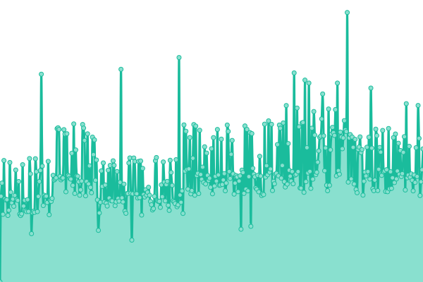
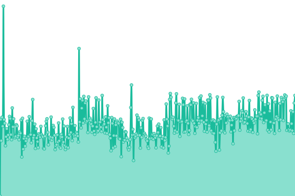
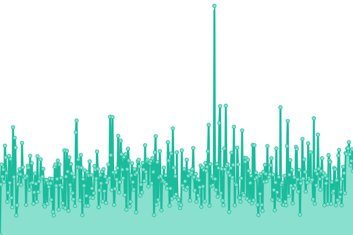
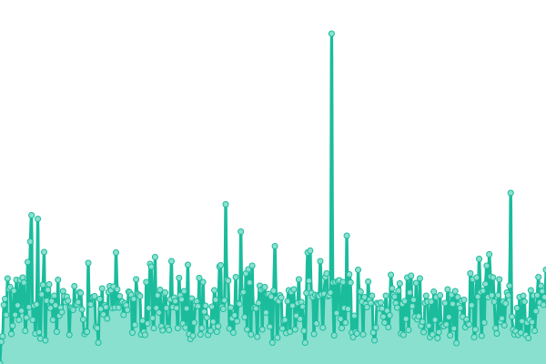

# [📈 Live Status](https://www.culliem.com): <!--live status--> **🟩 All systems operational**

This repository contains the open-source uptime monitor and status page for [Cullie McElduff](CullieM.com), powered by [Upptime](https://github.com/upptime/upptime).

With [Upptime](https://upptime.js.org), you can get your own unlimited and free uptime monitor and status page, powered entirely by a GitHub repository. We use [Issues](https://github.com/CullieM/status/issues) as incident reports, [Actions](https://github.com/CullieM/status/actions) as uptime monitors, and [Pages](https://www.culliem.com) for the status page.

<!--start: status pages-->
<!-- This summary is generated by Upptime (https://github.com/upptime/upptime) -->
<!-- Do not edit this manually, your changes will be overwritten -->
<!-- prettier-ignore -->
| URL | Status | History | Response Time | Uptime |
| --- | ------ | ------- | ------------- | ------ |
|  [Jellyfin](https://watch.cullie.dev) | 🟩 Up | [jellyfin.yml](https://github.com/CullieM/status/commits/HEAD/history/jellyfin.yml) | 

 1478ms
     
 | 

<a href="https://culliem.com/history/jellyfin">39.40%</a>
    

|  [Jellyseerr](https://request.cullie.dev) | 🟩 Up | [jellyseerr.yml](https://github.com/CullieM/status/commits/HEAD/history/jellyseerr.yml) | 

 1972ms
     
 | 

<a href="https://culliem.com/history/jellyseerr">100.00%</a>
    

|  [Personal Site](https://culliem.com) | 🟩 Up | [personal-site.yml](https://github.com/CullieM/status/commits/HEAD/history/personal-site.yml) | 

 149ms
     
 | 

<a href="https://culliem.com/history/personal-site">100.00%</a>
    

|  [Personal Site Redirect](https://cullie.dev) | 🟩 Up | [personal-site-redirect.yml](https://github.com/CullieM/status/commits/HEAD/history/personal-site-redirect.yml) | 

 141ms
     
 | 

<a href="https://culliem.com/history/personal-site-redirect">100.00%</a>
    

<!--end: status pages-->

[**Visit our status website →**](https://www.culliem.com)

## 📄 License

- Powered by: [Upptime](https://github.com/upptime/upptime)
- Code: [MIT](./LICENSE) © [Anand Chowdhary](https://anandchowdhary.com), supported by [Pabio](https://pabio.com)
- Data in the `./history` directory: [Open Database License](https://opendatacommons.org/licenses/odbl/1-0/)
